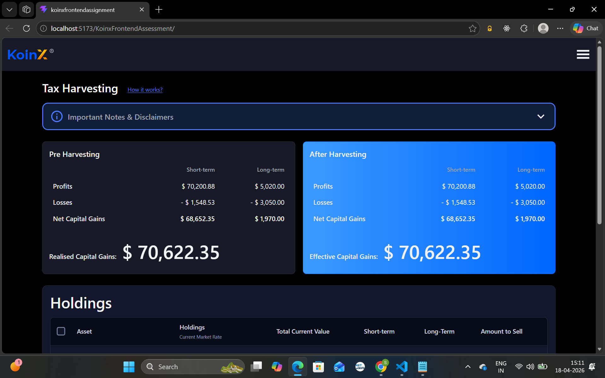
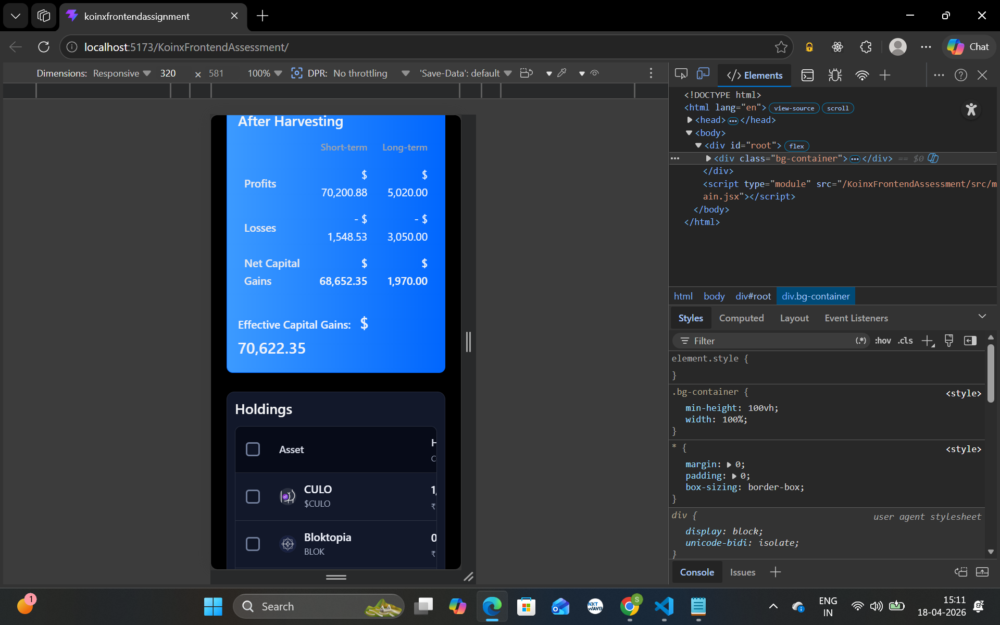
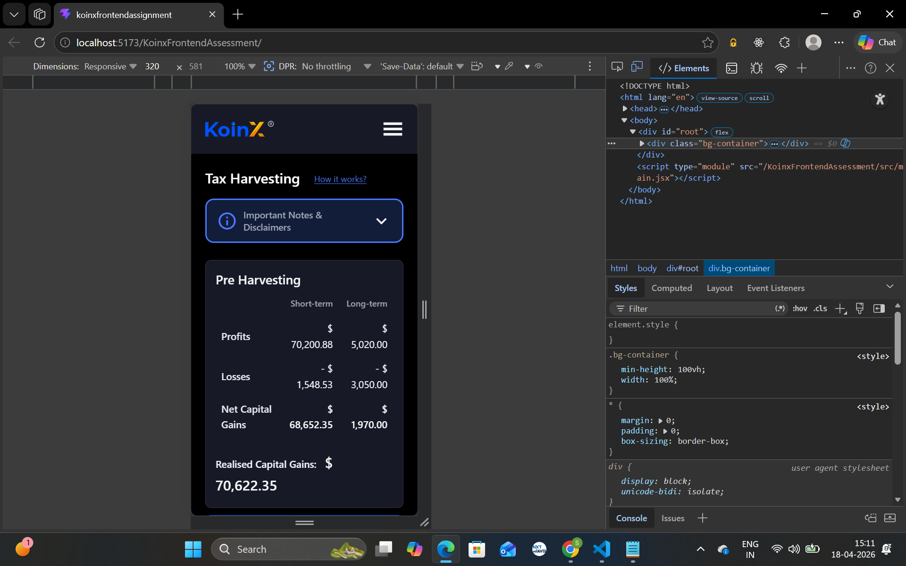
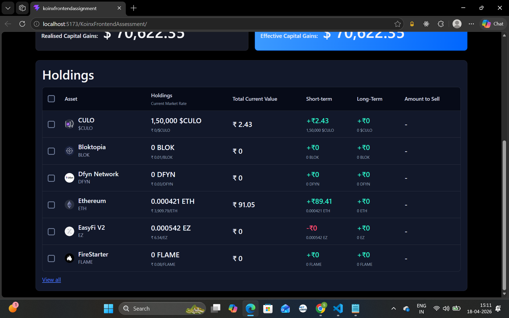

# KoinX Frontend Assessment

## Live Demo

Deploy link: https://sivaramachakradhar.github.io/KoinxFrontendAssessment/

## Setup Instructions

### Prerequisites

- Node.js 18 or later
- npm 9 or later

### 1. Clone the repository

```bash
git clone https://github.com/SivaRamaChakradhar/KoinxFrontendAssessment.git
cd KoinxFrontendAssessment
```

### 2. Install dependencies

```bash
npm install
```

### 3. Run the project locally

```bash
npm run dev
```

After running the command, open the local URL shown in the terminal (usually http://localhost:5173).

### 4. Create a production build

```bash
npm run build
```

### 5. Preview the production build

```bash
npm run preview
```

### 6. Deploy to GitHub Pages

```bash
npm run deploy
```

## UI Screenshots

### Dashboard View





### Mobile View




